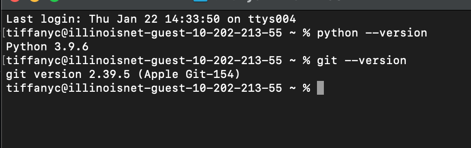
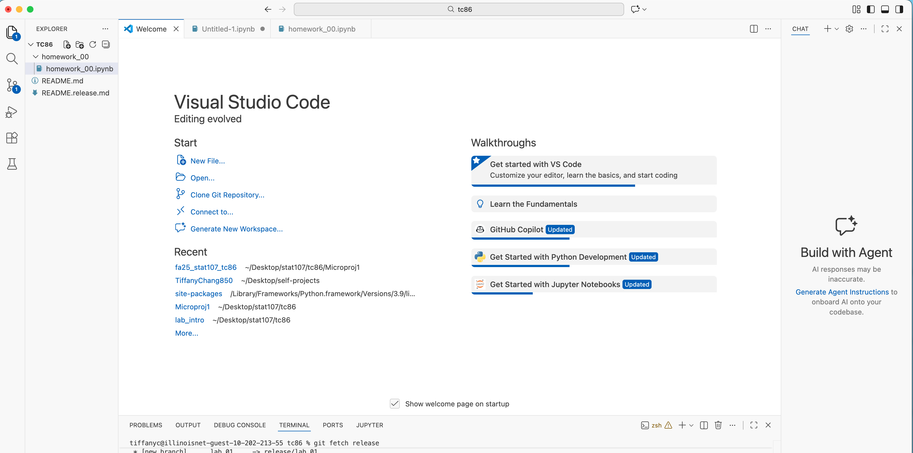
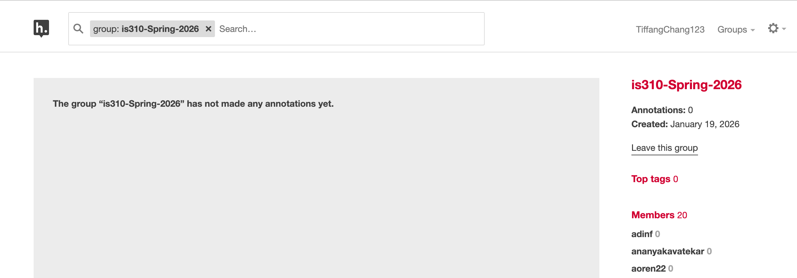

# Init IS310 Homework

## Proof of Installation

1. Python

2. Git
   

3. VS Studio Code

4. Hypothesis

5. AI Workflow
   I usually will not use AI, but if I were to use it, it would be chatgpt. I would use it for brainstorming ideas or checking my code when I have errors that I cannot solve.
