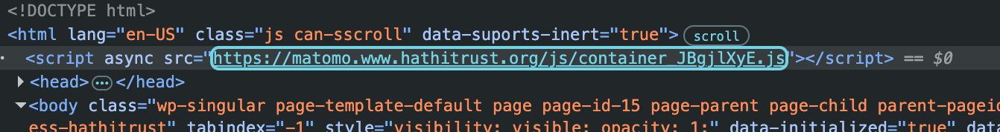

# Answer to Assignment 1

The digital library I am focusing on is HathiTrust. When inspecting the developer's tools of the webpage, I realized that the main web technologies used are definitely HTML and JavaScript (at first glance). The web format is using HTML, with functions like <head> and <body>; however, most of the files embedded are .js. No .css files seem to be included, though. From the screenshot, we can see one of the .js files. There doesn't seem to be any file that I don't recognize, though. 

According to Google, multiple universities, like the University of California and the University of Michigan, helped create this huge digital library. Both the HathiTrust website and the University of California mention this as well, implying the creation of this webpage was a collaborative effort. In addition, Hathitrus also lists people from Indiana University and the University of Illinois as part of their leadership.

